# Схема базы данных

База данных хранит пользователей, фильмы, режиссёров, жанры, дружеские связи, лайки, отзывы, оценки отзывов и события пользовательской активности.

## ER-диаграмма

```mermaid
erDiagram
    USERS {
        BIGINT id PK "GENERATED BY DEFAULT AS IDENTITY, NOT NULL"
        VARCHAR login
        VARCHAR email
        DATE birthday
        VARCHAR name
    }

    DIRECTORS {
        BIGINT id PK "GENERATED BY DEFAULT AS IDENTITY, NOT NULL"
        VARCHAR name "NOT NULL"
    }

    FILMS {
        BIGINT id PK "GENERATED BY DEFAULT AS IDENTITY, NOT NULL"
        VARCHAR name "NOT NULL"
        VARCHAR description "NOT NULL"
        DATE release_date "NOT NULL"
        INTEGER duration "NOT NULL"
        VARCHAR mpa
    }

    GENRES {
        BIGINT id PK "GENERATED BY DEFAULT AS IDENTITY, NOT NULL"
        VARCHAR name "NOT NULL"
    }

    FILM_DIRECTORS {
        BIGINT film_id PK, FK "NOT NULL, ON DELETE CASCADE"
        BIGINT director_id PK, FK "NOT NULL, ON DELETE CASCADE"
    }

    FILM_GENRES {
        BIGINT film_id PK, FK "NOT NULL, ON DELETE CASCADE"
        BIGINT genre_id PK, FK "NOT NULL, ON DELETE CASCADE"
    }

    FRIENDSHIPS {
        BIGINT user_id PK, FK "NOT NULL, ON DELETE CASCADE"
        BIGINT friend_id PK, FK "NOT NULL, ON DELETE CASCADE"
    }

    FILM_LIKES {
        BIGINT film_id PK, FK "NOT NULL, ON DELETE CASCADE"
        BIGINT user_id PK, FK "NOT NULL, ON DELETE CASCADE"
    }

    REVIEWS {
        BIGINT review_id PK "GENERATED BY DEFAULT AS IDENTITY, NOT NULL"
        VARCHAR content "VARCHAR(255), NULL"
        BOOLEAN is_positive "NOT NULL"
        BIGINT user_id FK "NOT NULL, ON DELETE CASCADE"
        BIGINT film_id FK "NOT NULL, ON DELETE CASCADE"
    }

    REVIEW_LIKES {
        BIGINT review_id PK, FK "NOT NULL, ON DELETE CASCADE"
        BIGINT user_id PK, FK "NOT NULL, ON DELETE CASCADE"
        BOOLEAN is_useful "NOT NULL"
    }

    FEED_EVENTS {
        BIGINT event_id PK "GENERATED BY DEFAULT AS IDENTITY, NOT NULL"
        BIGINT timestamp "NOT NULL"
        BIGINT user_id FK "NOT NULL, ON DELETE CASCADE"
        VARCHAR event_type "VARCHAR(20), NOT NULL"
        VARCHAR operation "VARCHAR(20), NOT NULL"
        BIGINT entity_id "NOT NULL"
    }

    FILMS ||--o{ FILM_DIRECTORS : "имеет"
    DIRECTORS ||--o{ FILM_DIRECTORS : "участвует в"

    FILMS ||--o{ FILM_GENRES : "имеет"
    GENRES ||--o{ FILM_GENRES : "назначается"

    USERS ||--o{ FRIENDSHIPS : "инициирует"
    USERS ||--o{ FRIENDSHIPS : "добавляется в"

    FILMS ||--o{ FILM_LIKES : "получает"
    USERS ||--o{ FILM_LIKES : "ставит"

    USERS ||--o{ REVIEWS : "создаёт"
    FILMS ||--o{ REVIEWS : "получает"

    REVIEWS ||--o{ REVIEW_LIKES : "оценивается"
    USERS ||--o{ REVIEW_LIKES : "оценивает"

    USERS ||--o{ FEED_EVENTS : "имеет"
```

## Основные таблицы

### `users`

| Поле | Тип | Nullable | Ограничения | Описание |
|---|---|---:|---|---|
| `id` | `BIGINT` | Нет | `PRIMARY KEY`, `GENERATED BY DEFAULT AS IDENTITY` | Уникальный идентификатор пользователя |
| `login` | `VARCHAR` | Да | — | Логин пользователя |
| `email` | `VARCHAR` | Да | — | Электронная почта |
| `birthday` | `DATE` | Да | — | Дата рождения |
| `name` | `VARCHAR` | Да | — | Имя пользователя |

| Ограничение | Значение |
|---|---|
| Первичный ключ | `id` |
| Автогенерация идентификатора | `GENERATED BY DEFAULT AS IDENTITY` |
| Внешние ключи | Отсутствуют |
| Уникальные ограничения | Отсутствуют |
| Каскадное удаление | Не применяется |

### `directors`

| Поле | Тип | Nullable | Ограничения | Описание |
|---|---|---:|---|---|
| `id` | `BIGINT` | Нет | `PRIMARY KEY`, `GENERATED BY DEFAULT AS IDENTITY` | Уникальный идентификатор режиссёра |
| `name` | `VARCHAR` | Нет | `NOT NULL` | Имя режиссёра |

| Ограничение | Значение |
|---|---|
| Первичный ключ | `id` |
| Автогенерация идентификатора | `GENERATED BY DEFAULT AS IDENTITY` |
| Внешние ключи | Отсутствуют |
| Уникальные ограничения | Отсутствуют |
| Каскадное удаление | Не применяется |

### `films`

| Поле | Тип | Nullable | Ограничения | Описание |
|---|---|---:|---|---|
| `id` | `BIGINT` | Нет | `PRIMARY KEY`, `GENERATED BY DEFAULT AS IDENTITY` | Уникальный идентификатор фильма |
| `name` | `VARCHAR` | Нет | `NOT NULL` | Название фильма |
| `description` | `VARCHAR` | Нет | `NOT NULL` | Описание фильма |
| `release_date` | `DATE` | Нет | `NOT NULL` | Дата выхода фильма |
| `duration` | `INTEGER` | Нет | `NOT NULL` | Продолжительность в минутах |
| `mpa` | `VARCHAR` | Да | — | Возрастной рейтинг MPA |

| Ограничение | Значение |
|---|---|
| Первичный ключ | `id` |
| Автогенерация идентификатора | `GENERATED BY DEFAULT AS IDENTITY` |
| Внешние ключи | Отсутствуют |
| Уникальные ограничения | Отсутствуют |
| Каскадное удаление | Не применяется |

### `genres`

| Поле | Тип | Nullable | Ограничения | Описание |
|---|---|---:|---|---|
| `id` | `BIGINT` | Нет | `PRIMARY KEY`, `GENERATED BY DEFAULT AS IDENTITY` | Уникальный идентификатор жанра |
| `name` | `VARCHAR` | Нет | `NOT NULL` | Название жанра |

| Ограничение | Значение |
|---|---|
| Первичный ключ | `id` |
| Автогенерация идентификатора | `GENERATED BY DEFAULT AS IDENTITY` |
| Внешние ключи | Отсутствуют |
| Уникальные ограничения | Отсутствуют |
| Каскадное удаление | Не применяется |

### Начальные данные `genres`

| ID | Название |
|---:|---|
| 1 | Комедия |
| 2 | Драма |
| 3 | Мультфильм |
| 4 | Триллер |
| 5 | Документальный |
| 6 | Боевик |

## Связующие таблицы

### `film_directors`

Связывает фильмы и режиссёров отношением «многие-ко-многим».

| Поле | Тип | Nullable | Ограничения | Описание |
|---|---|---:|---|---|
| `film_id` | `BIGINT` | Нет | `PRIMARY KEY`, `FOREIGN KEY → films.id`, `NOT NULL`, `ON DELETE CASCADE` | Идентификатор фильма |
| `director_id` | `BIGINT` | Нет | `PRIMARY KEY`, `FOREIGN KEY → directors.id`, `NOT NULL`, `ON DELETE CASCADE` | Идентификатор режиссёра |

| Ограничение | Значение |
|---|---|
| Первичный ключ | (`film_id`, `director_id`) |
| Внешний ключ 1 | `film_id → films.id` |
| Внешний ключ 2 | `director_id → directors.id` |
| Каскадное удаление | Для обоих внешних ключей |
| Защита от дублирования | Составной первичный ключ не допускает повторной пары фильма и режиссёра |

### `film_genres`

Связывает фильмы и жанры отношением «многие-ко-многим».

| Поле | Тип | Nullable | Ограничения | Описание |
|---|---|---:|---|---|
| `film_id` | `BIGINT` | Нет | `PRIMARY KEY`, `FOREIGN KEY → films.id`, `NOT NULL`, `ON DELETE CASCADE` | Идентификатор фильма |
| `genre_id` | `BIGINT` | Нет | `PRIMARY KEY`, `FOREIGN KEY → genres.id`, `NOT NULL`, `ON DELETE CASCADE` | Идентификатор жанра |

| Ограничение | Значение |
|---|---|
| Первичный ключ | (`film_id`, `genre_id`) |
| Внешний ключ 1 | `film_id → films.id` |
| Внешний ключ 2 | `genre_id → genres.id` |
| Каскадное удаление | Для обоих внешних ключей |
| Защита от дублирования | Составной первичный ключ не допускает повторного назначения жанра фильму |

### `friendships`

Хранит направленные дружеские связи между пользователями.

| Поле | Тип | Nullable | Ограничения | Описание |
|---|---|---:|---|---|
| `user_id` | `BIGINT` | Нет | `PRIMARY KEY`, `FOREIGN KEY → users.id`, `NOT NULL`, `ON DELETE CASCADE` | Пользователь, добавляющий друга |
| `friend_id` | `BIGINT` | Нет | `PRIMARY KEY`, `FOREIGN KEY → users.id`, `NOT NULL`, `ON DELETE CASCADE` | Пользователь, добавленный в друзья |

| Ограничение | Значение |
|---|---|
| Первичный ключ | (`user_id`, `friend_id`) |
| Внешний ключ 1 | `user_id → users.id` |
| Внешний ключ 2 | `friend_id → users.id` |
| Каскадное удаление | Для обоих внешних ключей |
| Защита от дублирования | Составной ключ запрещает повторить одну и ту же направленную связь |

### `film_likes`

Хранит лайки, поставленные пользователями фильмам.

| Поле | Тип | Nullable | Ограничения | Описание |
|---|---|---:|---|---|
| `film_id` | `BIGINT` | Нет | `PRIMARY KEY`, `FOREIGN KEY → films.id`, `NOT NULL`, `ON DELETE CASCADE` | Идентификатор фильма |
| `user_id` | `BIGINT` | Нет | `PRIMARY KEY`, `FOREIGN KEY → users.id`, `NOT NULL`, `ON DELETE CASCADE` | Идентификатор пользователя |

| Ограничение | Значение |
|---|---|
| Первичный ключ | (`film_id`, `user_id`) |
| Внешний ключ 1 | `film_id → films.id` |
| Внешний ключ 2 | `user_id → users.id` |
| Каскадное удаление | Для обоих внешних ключей |
| Защита от дублирования | Один пользователь может поставить одному фильму только один лайк |

## Отзывы и лента

### `reviews`

Хранит отзывы пользователей о фильмах.

| Поле | Тип | Nullable | Ограничения | Описание |
|---|---|---:|---|---|
| `review_id` | `BIGINT` | Нет | `PRIMARY KEY`, `GENERATED BY DEFAULT AS IDENTITY` | Уникальный идентификатор отзыва |
| `content` | `VARCHAR(255)` | Да | — | Текст отзыва |
| `is_positive` | `BOOLEAN` | Нет | `NOT NULL` | Признак положительного отзыва |
| `user_id` | `BIGINT` | Нет | `FOREIGN KEY → users.id`, `NOT NULL`, `ON DELETE CASCADE` | Автор отзыва |
| `film_id` | `BIGINT` | Нет | `FOREIGN KEY → films.id`, `NOT NULL`, `ON DELETE CASCADE` | Фильм, к которому оставлен отзыв |

| Ограничение | Значение |
|---|---|
| Первичный ключ | `review_id` |
| Автогенерация идентификатора | `GENERATED BY DEFAULT AS IDENTITY` |
| Уникальное ограничение | (`user_id`, `film_id`) |
| Внешний ключ 1 | `user_id → users.id` |
| Внешний ключ 2 | `film_id → films.id` |
| Каскадное удаление | Для обоих внешних ключей |
| Бизнес-правило | Один пользователь может оставить только один отзыв на один фильм |

### `review_likes`

Хранит оценки полезности отзывов.

| Поле | Тип | Nullable | Ограничения | Описание |
|---|---|---:|---|---|
| `review_id` | `BIGINT` | Нет | `PRIMARY KEY`, `FOREIGN KEY → reviews.review_id`, `NOT NULL`, `ON DELETE CASCADE` | Идентификатор отзыва |
| `user_id` | `BIGINT` | Нет | `PRIMARY KEY`, `FOREIGN KEY → users.id`, `NOT NULL`, `ON DELETE CASCADE` | Пользователь, оценивший отзыв |
| `is_useful` | `BOOLEAN` | Нет | `NOT NULL` | Оценка полезности: `true` — полезно, `false` — не полезно |

| Ограничение | Значение |
|---|---|
| Первичный ключ | (`review_id`, `user_id`) |
| Внешний ключ 1 | `review_id → reviews.review_id` |
| Внешний ключ 2 | `user_id → users.id` |
| Каскадное удаление | Для обоих внешних ключей |
| Защита от дублирования | Один пользователь может оценить один отзыв только один раз |

### `feed_events`

Хранит события пользовательской активности для ленты.

| Поле | Тип | Nullable | Ограничения | Описание |
|---|---|---:|---|---|
| `event_id` | `BIGINT` | Нет | `PRIMARY KEY`, `GENERATED BY DEFAULT AS IDENTITY` | Идентификатор события |
| `timestamp` | `BIGINT` | Нет | `NOT NULL` | Момент возникновения события в Unix timestamp |
| `user_id` | `BIGINT` | Нет | `FOREIGN KEY → users.id`, `NOT NULL`, `ON DELETE CASCADE` | Пользователь, с которым связано событие |
| `event_type` | `VARCHAR(20)` | Нет | `NOT NULL` | Тип события: например, `LIKE`, `REVIEW`, `FRIEND` |
| `operation` | `VARCHAR(20)` | Нет | `NOT NULL` | Операция: например, `ADD`, `REMOVE`, `UPDATE` |
| `entity_id` | `BIGINT` | Нет | `NOT NULL` | Идентификатор связанной сущности |

| Ограничение | Значение |
|---|---|
| Первичный ключ | `event_id` |
| Автогенерация идентификатора | `GENERATED BY DEFAULT AS IDENTITY` |
| Внешний ключ | `user_id → users.id` |
| Каскадное удаление | При удалении пользователя удаляются его события |
| Ограничения для `entity_id` | Внешний ключ отсутствует; поле является полиморфной ссылкой |
| Интерпретация `entity_id` | Зависит от `event_type`: фильм для `LIKE`, отзыв для `REVIEW`, пользователь для `FRIEND` |

## Сводка ограничений

| Таблица | Первичный ключ | Уникальные ограничения | Внешние ключи | Каскадное удаление |
|---|---|---|---|---|
| `users` | `id` | — | — | — |
| `directors` | `id` | — | — | — |
| `films` | `id` | — | — | — |
| `genres` | `id` | — | — | — |
| `film_directors` | (`film_id`, `director_id`) | Составной первичный ключ | `film_id → films.id`, `director_id → directors.id` | Для обоих внешних ключей |
| `film_genres` | (`film_id`, `genre_id`) | Составной первичный ключ | `film_id → films.id`, `genre_id → genres.id` | Для обоих внешних ключей |
| `friendships` | (`user_id`, `friend_id`) | Составной первичный ключ | `user_id → users.id`, `friend_id → users.id` | Для обоих внешних ключей |
| `film_likes` | (`film_id`, `user_id`) | Составной первичный ключ | `film_id → films.id`, `user_id → users.id` | Для обоих внешних ключей |
| `reviews` | `review_id` | `UNIQUE (user_id, film_id)` | `user_id → users.id`, `film_id → films.id` | Для обоих внешних ключей |
| `review_likes` | (`review_id`, `user_id`) | Составной первичный ключ | `review_id → reviews.review_id`, `user_id → users.id` | Для обоих внешних ключей |
| `feed_events` | `event_id` | — | `user_id → users.id` | Для `user_id` |